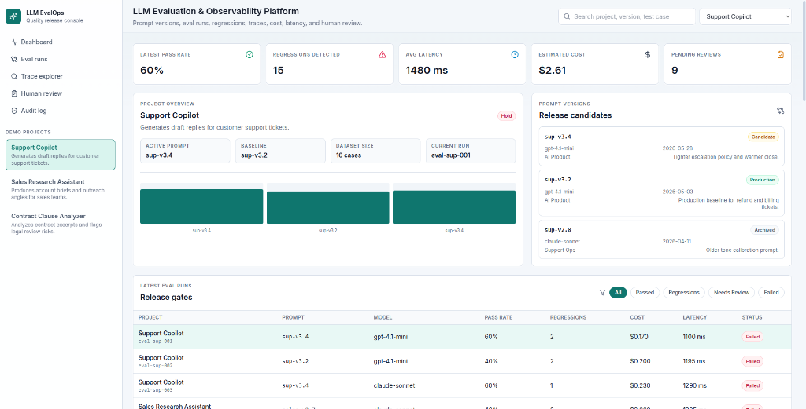
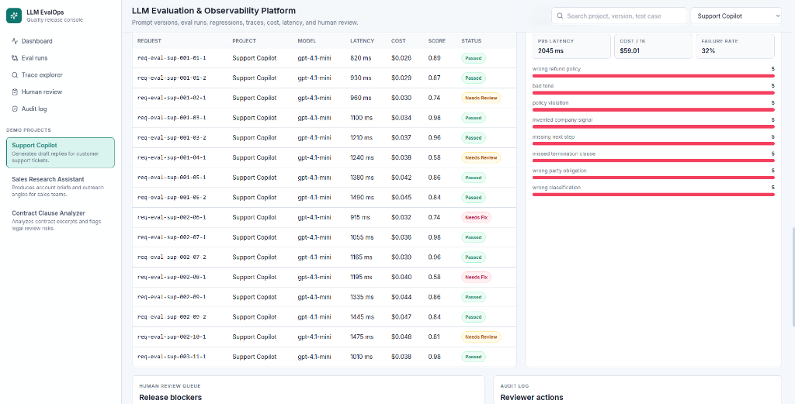
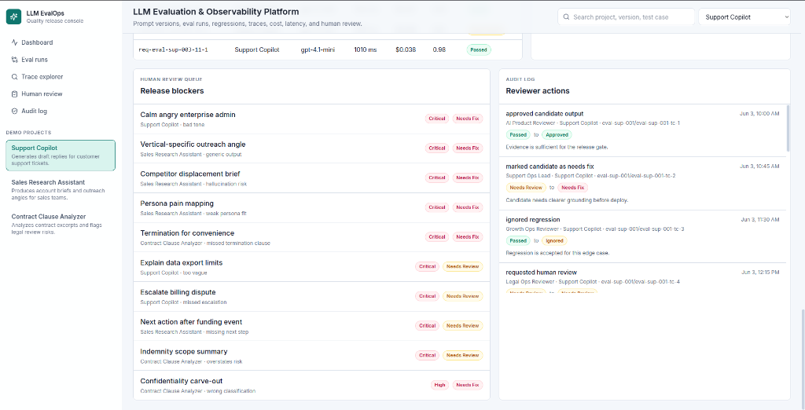

# LLM Evaluation & Observability Platform

[](https://github.com/Daniel5569/llm-evaluation-observability-platform/actions/workflows/ci.yml)
[](LICENSE)

**[→ Live Demo](https://llm-evaluation-observability-platfo.vercel.app)** · **[→ GitHub](https://github.com/Daniel5569/llm-evaluation-observability-platform)**


A production-shaped demo for tracking prompt quality, regression risk, traces, cost, latency, and human review across AI product workflows. Run locally in under two minutes — no API keys, no external services.

```bash
npm install && npm run dev   # open http://localhost:3000
```

## Problem

AI startups ship prompt and model changes without a repeatable release loop. The result: regressions reach production, bad outputs stay invisible, and human reviewers have no structured queue. Teams need fast answers to:

- Did the new prompt improve or regress against the baseline?
- Which test cases failed — and why?
- Where are cost and latency creeping up?
- Which outputs need human sign-off before deploy?
- Should this candidate **ship**, **wait for review**, or be **held**?

## What This Demo Shows

An internal console for AI product and engineering teams:

| Surface | What it does |
|---|---|
| **KPI row** | Latest pass rate, regression count, avg latency, estimated cost, pending reviews |
| **Release gates table** | All eval runs with status, pass rate, regressions, pending reviews, model, prompt version |
| **Scorecard** | Metric-by-metric breakdown for baseline vs candidate |
| **Regression table** | Every failing test case with delta, severity, and failure category |
| **Trace detail panel** | Full test case: input, context, expected, baseline output, candidate output, cost, latency |
| **Human review queue** | Prioritized by severity; reviewer can approve, mark needs fix, or ignore |
| **Audit log** | Immutable history of every reviewer action with before/after status and note |
| **Observability view** | Error category breakdown, p95 latency, cost per 1k requests, failure rate |

Release recommendation is deterministic: **ship** (≥90% pass rate, no severe regressions, <3 pending), **needs review**, or **hold** (any severe regression or <80% pass rate).

## Demo Projects

1. **Support Copilot** — reply generation scored on helpfulness, policy compliance, tone, factuality, escalation correctness
2. **Sales Research Assistant** — account briefs scored on relevance, specificity, source grounding, hallucination risk, actionability
3. **Contract Clause Analyzer** — risk review scored on clause extraction, risk classification, missing obligation detection, summary quality

All data is synthetic and deterministic. No API keys required.

## 90-Second Walkthrough

1. Check the KPI row: latest pass rate, regression count, pending reviews.
2. Select **Support Copilot** from the project switcher.
3. Open the latest eval run from the release gate table.
4. Read the scorecard — note which metrics regressed.
5. Pick a failed test case; inspect baseline vs candidate output side by side.
6. Mark it **Needs fix** with a note.
7. Confirm the audit log records the action with before/after status.

## Screenshots


*Release gate dashboard: pass rate, regressions, latency, cost, pending reviews at a glance*


*Trace explorer: per-request latency, cost, score, and failure category breakdown*


*Human review queue and audit log: reviewer actions with before/after status and notes*

## System Architecture

This repo is the dashboard layer of a production eval system. The full data flow:

```text
LLM Provider (OpenAI / Anthropic / Gemini)
        │
        ▼
  Ingest API  ──────────────────────────────────────────────────────┐
  (Next.js API routes or FastAPI)                                    │
        │                                                            │
        ▼                                                            │
  Redis Streams                                                      │
  (buffer for high-volume eval trace ingest)                        │
        │                                                            │
        ▼                                                            │
  Scoring Worker                                                     │
  (Python / async consumer group)                                    │
  - calculateWeightedScore()                                         │
  - detectRegressions()                                              │
  - classifySeverity()                                               │
  - getDeploymentRecommendation()                                    │
        │                                                            │
        ▼                                                            │
  PostgreSQL                                                         │
  (eval results, audit log, traces)                                  │
        │                                                            │
        ▼                                                            ◄┘
  This Dashboard  (Next.js SPA — what this repo implements)
  - Release gates  - Scorecard  - Regression table
  - Trace detail   - Review queue  - Audit log
```

The demo runs the scoring worker logic in-browser with deterministic seed data so the full product workflow is visible without infrastructure setup.

## Evaluation Model

Scoring logic lives in `lib/evaluation-engine.ts` as pure, tested functions:

- **`calculateWeightedScore(scores, weights)`** — weighted average of metric scores
- **`calculatePassRate(testCases)`** — % of cases meeting score threshold with approved/passed status
- **`detectRegressions(testCases, threshold)`** — cases where candidate falls >8% below baseline
- **`classifySeverity(delta)`** — critical (>28%), high (>18%), medium (>10%), low
- **`getDeploymentRecommendation(input)`** — deterministic ship / needs review / hold
- **`applyReviewerAction(params)`** — returns updated test case + immutable audit event

## Tech Stack

- Next.js 15 App Router, React 19, TypeScript (strict)
- Tailwind CSS, Lucide icons
- Vitest — 8 tests covering happy path and edge cases
- GitHub Actions CI: lint → type check → test → build
- Local deterministic seed data (no external dependencies)

## Local Setup

```bash
git clone https://github.com/Daniel5569/llm-evaluation-observability-platform.git
cd llm-evaluation-observability-platform
npm install
npm run dev
```

Open `http://localhost:3000`.

## Commands

```bash
npm run lint    # ESLint with zero-warning policy
npm run build   # Production build + type check
npm test        # Vitest
```

## Deploy to Vercel

[](https://vercel.com/new/clone?repository-url=https://github.com/Daniel5569/llm-evaluation-observability-platform)

No environment variables required.

## Synthetic Data and Privacy

This repository uses synthetic projects, tickets, account signals, contract excerpts, traces, costs, scores, users, and audit events. It does not require API keys and contains no private customer data, personal contact details, credentials, or production logs.

## Why Not LangSmith or Weights & Biases?

Off-the-shelf observability tools are great for individual developers experimenting with prompts. Internal tooling becomes valuable when the team needs custom release gates tied to product-specific metrics, a human review queue integrated with your existing workflow, and audit trails scoped to your deployment process — without routing production outputs through a third-party platform.
